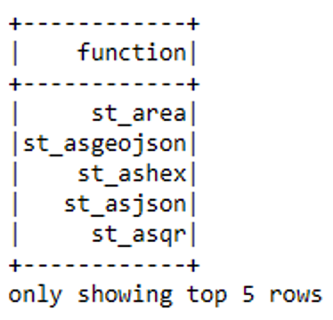

# Big Data Toolkit ArcGIS Pro Samples

A collection of example notebooks that demonstrate the use of Big Data Toolkit 3 from ArcGIS Pro.

## Getting Started

### Prerequisites

- ArcGIS Pro 2.9
- [Git for Windows](https://git-scm.com/download/win)
- The BDT 3 jar and egg files
- A license for BDT

### Install Apache Spark

ArcGIS Pro includes a built-in Spark runtime but you will need to install a separate Spark environment for BDT as the built-in Spark is missing libraries that BDT expects.

1. Download [spark-3.2.1-bin-hadoop3.2.tgz](https://www.apache.org/dyn/closer.lua/spark/spark-3.2.1/spark-3.2.1-bin-hadoop3.2.tgz), which is the most recent stable version of Spark at the time of writing. Newer versions of Spark 3.2+ might also work. BDT will not work with Spark 3.1 without modification. If you need to use Spark 3.1, for example, because you are relying on AWS EMR, you will need a special build of BDT. 

2. Extract the  archive into a folder.

3. Define the system environment variable `SPARK_HOME` and point it to the folder where you extracted the archive, e.g., `C:\spark-3.2.1-bin-hadoop3.2`

### Create a Pro Conda Environment for BDT

This will create a new environment for Pro's Anaconda Python distribution designated for working with BDT and Apache Spark. 

4. Start the Python Command Prompt from the ArcGIS folder of your Windows start menu. You will know that you are using the correct Python command prompt if the prompt's window title points to the `proenv.exe` executable located in the ArcGIS Pro installation directory.
5. Create a new conda environment:

```commandline
proswap arcgispro-py3
conda create --yes --name bdt3 --clone arcgispro-py3
proswap bdt3
```

6. Define the `PYSPARK_PYTHON` system environment variable and point it to the location of your bdt3 Conda environment, e.g., `C:\Users\%USERNAME%\AppData\Local\ESRI\conda\envs\spark_esri2\python.exe`.

### Install the Spark Esri module.

This Python module provides convenience functions for working with Spark from ArcGIS Pro. 

7. Clone the Spark Esri GitHub repository and install it into the `bdt3` conda environment by running these commands from the Python command prompt, making sure that `bdt3` is the active conda environment. It doesn't really matter where you clone the repository. The following commands wlll clone it into a folder called `repos` in the user's home directory. You can change this location to your liking.

```commandline
mkdir ~\repos
cd ~\repos
git clone https://github.com/mraad/spark-esri.git
cd spark-esri
python setup.py install
```

### Install BDT

BDT is delivered as a fat Java Archive (JAR) file. You will also need the BDT Python bindings as an .egg file. Finally, you should have received a BDT license file.

7. Place all three files into a folder. They don't all three have to be in the same folder. The examples assume that all three files are located in the user's home directory in a folder called `bdt3`.

### Use BDT 3 Python functions in ArcGIS Pro

Your are now ready to use BDT 3 from an ArcGIS Pro notebook.

8. Start ArcGIS Pro.

9. Create a new notebook by clicking the Insert tab on the ribbon, and then clicking the New Notebook button.

10. Insert a cell into your notebook and paste the following code (modify the `spark.jars` and `spark.submit.pyFiles` parameters as needed).

```python
from spark_esri import spark_start, spark_stop

spark_stop()

config = {
    "spark.driver.memory":"4G",
    "spark.kryoserializer.buffer.max":"2024",
    "spark.jars": "C:\\Users\\%USERNAME%\\bdt3\\bdt-3.0.0-3.2.0-2.12-merge-20220329.5.jar",
    "spark.submit.pyFiles": "C:\\Users\\%USERNAME%\\bdt-3.0.0+snapshot.merge.20220329.5-py3.9.egg"
}

spark = spark_start(config=config)
```

11. Run the cell, which will start Spark inside ArcGIS Pro. This might take a minute.

12. The last bootstrapping step is activating the license. Insert another cell, paste the code shown below, and run the cell. 

```python
import os
import bdt
bdt.auth(os.path.join("C:", os.sep, "Users", "%USERNAME%", "bdt", "bdt3.lic"))
```

13. You are now ready to run BDT Python functions:

```python
spark.sql("""
SHOW USER FUNCTIONS LIKE 'ST_*'
""").show(5)
```



You can find a BDT API documentation [here](https://esrips.github.io/bdt2/#bdt-v2). Note, this documentation hadn't been updated for BDT 3 at the time of writing. 

